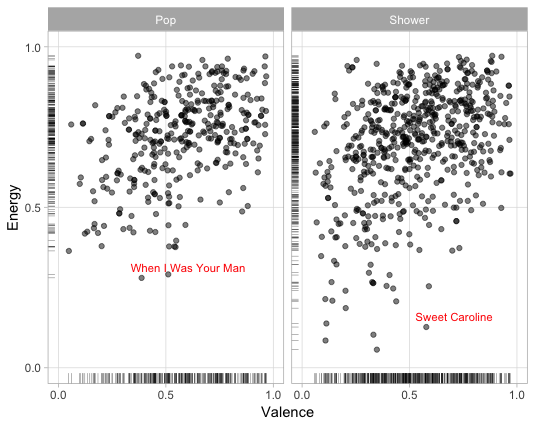
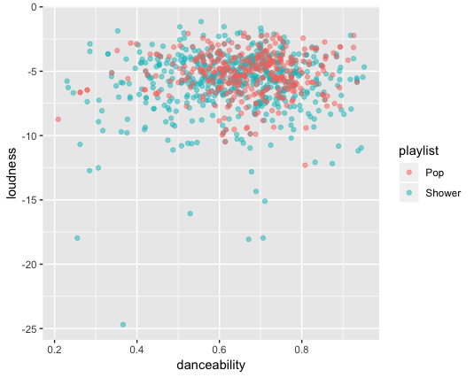

## A Closer Look at 'Singing in the Shower' Playlists
###### Anika Sindhwani, Computational Musicology

#### Corpus Definition and Evaluation

&ensp;&ensp;&ensp;&ensp; I will be looking specifically at what it means to be a ‘singing in the shower’ playlist. As such, my corpus will include the following Spotify playlists: “Songs to Sing in the Shower”, “shower / sing-a-long”, and “Shower”. I will also be including the following playlists that feature similar songs, but aren’t targeted as ‘singing in the shower’ playlists: “Pop Hits Rewind” and “Pop Hits 2000-2018”. By including both sets of playlists, this corpus will represent playlists with generally similar songs, but that are or are not classified as ‘singing in the shower’ playlists. By comparing these groups, I will try to see if there is a measurable difference in certain attributes measured by Spotify, to define what it means to be a ‘singing in the shower’ playlist. I chose the most-followed ‘singing in the shower’ playlists on Spotify, so I believe it should be a good representation of music that people do enjoy while showering. 

#### Initial Track-Level Feature Discoveries

&ensp;&ensp;&ensp;&ensp; Interestingly, comparing the shower playlists to the generic pop playlists, the means and standard deviations for most of the features are quite similar. For example, the mean tempo for both sets is 122, with standard deviations 26.9 and 26.5, respectively. The biggest noticeable differences in these measurements is in track popularly, with the shower playlists mean at 50.6 with standard deviation 26.1 vs. that of the pop playlists mean at 57.6 with standard deviation 22.3. That said, the maximum value for track popularity is 100 for the shower playlists and only 87 for the pop playlists. There is also a noticeable difference in maximum speechiness (0.592 vs. 0.453), maximum instrumentalness (0.829 vs. 0.947), maximum liveness (0.843 vs. 0.776), and maximum duration (5.568 vs. 8.069 minutes).

#### Examination of Outliers 
  
&ensp;&ensp;&ensp;&ensp; There are a few song outliers in each playlist, when comparing mean attribute values of each playlist and individual attribute values for the songs. For example, “Emergency” by Icona Pop has energy 0.969, danceability 0.834, and liveness 0.068, which are all values outside one or more standard deviations of the means for these values. I do believe I should include these values, especially since the two groups of playlists have similar mean and standard deviation values for most of the attributes, so that I can try to find meaningful differentiations between the two sets of playlists. 

#### First Insights using Data Visualizations

&ensp;&ensp;&ensp;&ensp; Looking at this first scatterplot, we see the greatest concentration of music, for both playlists, in the quadrant with high energy and high valence. This seems valid, given both playlists seem to have a large mix of fast-paced, loud, and cheerful music. As such, we can see our first real similarity in both playlists. 

&ensp;&ensp;&ensp;&ensp; More interestingly, we see that the ‘singing in the shower’ playlists have a wider array of music. Particularly, it seems to have a decent proportion of songs with 0-0.5 valence, as compared to the 'pop' playlist. One theory for this is that top charts 'pop' music is generally "catchy" because it has a positive and fast beat, but songs that people generally like to sing along to can be happy or more angry, that usually have fast and loud beats. Neither, however, seem to have much music with low energy and low valence, but music in that category tends to be perceived as sadder, which makes it less likely to be considered a 'pop' song, and also most likely makes it not as fun to sing in the shower (though this is mere speculation on my behalf).

&ensp;&ensp;&ensp;&ensp; What is interesting to note about this scatterplot is that, like the other plot, most of the music from both playlists is concentrated in the same area. In the case of danceability, it's around ~0.6, and for loudness, it's closest to ~-5. That said, the 'singing in the shower' playlist does seem to have a greater range in terms of both danceability and loudness, which is a trend we noticed with the energy vs. valence plots as well. One potential cause of this is that the shower playlist being examined has a greater number than songs than the pop playlists. To disconsider this from later findings, I will try to use a more equal number of songs for both playlists, and re-examine the plots. Aside from that explanation, one possible cause for this spread of data is that, similar to before, 'pop' songs that are generally the most enjoyed are ones that are loud, and also that are good to dance to (both at clubs/parties, and at home). On the other hand, music that is enjoyed while showering may not need to be good to dance along to (since there is generally not space to dance in the shower), but mostly on the louder side, so that people can still "belt out tunes" while showering. This distribution of data seems valid to me, as someone that enjoys singing in the shower to a variety of music, but further research will be necessary, most likely with a more significant number of playlist songs, to paint a clearer picture of defining 'singing in the shower' characteristics. 

