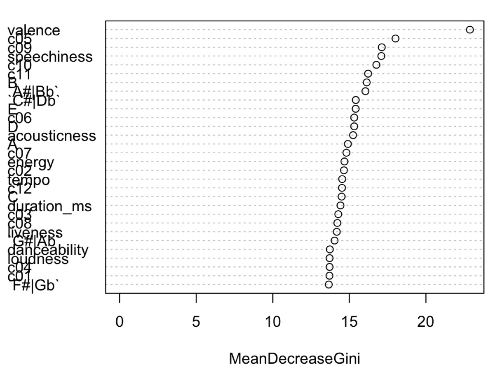
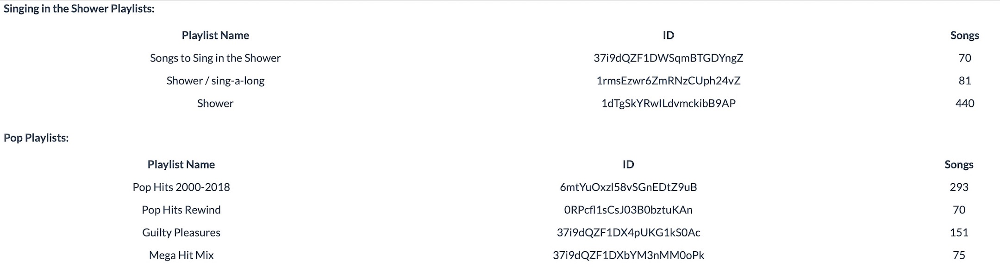

```{r setup, include=FALSE}
knitr::opts_chunk$set(echo = TRUE)

# Import libraries
library(tidyverse)
library(tidymodels)
library(spotifyr)
library(plotly)
library(compmus)
library(ggdendro)
library(protoclust)
library(knitr)
library(ggpubr)

# Import set-up files
source('spotify.R')
source('visualizations.R')
```

```{r, echo=FALSE}
# Set up variables
shower_playlist_1 <- get_playlist_audio_features("", "37i9dQZF1DWSqmBTGDYngZ")
shower_playlist_2 <- get_playlist_audio_features("kyarahamers", "1rmsEzwr6ZmRNzCUph24vZ")
shower_playlist_3 <- get_playlist_audio_features("agward", "1dTgSkYRwILdvmckibB9AP")
shower_playlists <- rbind(shower_playlist_1, shower_playlist_2, shower_playlist_3)

pop_playlist_1 <- get_playlist_audio_features("maka_97", "6mtYuOxzl58vSGnEDtZ9uB")
pop_playlist_2 <- get_playlist_audio_features("getmusicasia", "0RPcfl1sCsJ03B0bztuKAn")
pop_playlist_3 <- get_playlist_audio_features("", "37i9dQZF1DX4pUKG1kS0Ac")
pop_playlist_4 <- get_playlist_audio_features("", "37i9dQZF1DXbYM3nMM0oPk")
pop_playlists <- rbind(pop_playlist_1, pop_playlist_2, pop_playlist_3)

all_music <-
  shower_playlists %>% mutate(playlist = "Shower") %>%
  bind_rows(pop_playlists %>% mutate(playlist = "Pop"))
```

### [Background] What does it mean to be a 'singing in the shower' playlist, and how do such playlists differ from generic pop playlists?
<!-- What is a 'singing in the shower' playlist, and how does it differ from a generic pop playlist? -->
<!-- What Does It Mean to Be a 'Singing in the Shower' Playlist, and How Does It Differ From a Generic Pop Playlist? -->


***
 
This corpus will represent playlists with generally similar songs, but that are either classified as **‘singing in the shower’** playlists or **pop** playlists. By comparing these groups, I will try to see if there is a measurable difference in certain attributes measured by Spotify, to define what it means to be a ‘singing in the shower’ playlist. I chose the most-followed ‘singing in the shower’ playlists on Spotify, so I believe it should be a good representation of music that people do enjoy while showering. 

The 'singing in the shower' playlists used:

* Songs to Sing in the Shower
* Shower / sing-a-long 
* Shower     

The pop playlists used:

* Pop Hits 2000-2018
* Pop Hits Rewind
* Guilty Pleasures
* Mega Hit Mix

For more information on the playlists used, take a look at the Appendix storyboard.


### [Classification] A random forest classification of the sets of playlists helps identify their most important differentiating features.
<!-- Random Forest Classification of Playlists -->

```{r, echo = FALSE}
#get_random_forest(shower_playlists, pop_playlists)
```


*** 

Based on the Random Forest classification, we find that the most important differentiating feature is valence, with MeanDecreaseGini ~ 23. The next most important features are speechiness, with MeanDecreaseGini ~ 17, and c05, c09, and B (all with MeanDecreaseGini ~16). 

We use these top features in our kNN classification, which we can see the results of in the next storyboard. We also use these top features throughout our storyboards, when choosing track-level features to analyze and songs to compare that are representative of each set of playlists. 


### [Classification] The kNN classification of the playlists shows how well a computer can tell 'singing in the shower' and pop playlists apart (spoiler: not well).
<!-- kNN Classification of Playlists Based on Random Forest Results -->

```{r, echo = FALSE}
get_kNN_classification(shower_playlists, pop_playlists)
```

*** 

This kNN classifier, even with modified and optimized feature values from the random forest classification, only achieved an accuracy of 0.55. This is only a slightly better performance than if one were to guess the playlist with a coin flip (and achieve ~0.5 accuracy). This is also the case even when using the full dataset for both sets of playlists. So, it seems to indicate that it's quite difficult to classify a song from both sets of playlists as being from either a 'singing in the shower' playlist or a pop playlist.

These results show a trend that we will see throughout the storyboards as we explore other features in depth: it's very difficult to differentiate 'singing in the shower' playlists from pop playlists, and as such, it's increasingly difficult to define 'singing in the shower' playlists, without really being able to separate the two. 

<!-- # A tibble: 3 x 3
  .metric  .estimator .estimate
  <chr>    <chr>          <dbl>
1 accuracy binary          0.55
2 kap      binary          0.1 
3 j_index  binary          0.1 -->


### [Track-level features] Looking at the energy and valence for both sets of playlists, we see valid distributions of data and much overlap. 
<!-- Examining the Energy and Valence for Both Sets of Playlists -->

```{r, echo=FALSE}
get_energy_valence_plot(all_music)
```

*** 

Generally, when looking at pop music, a valence vs. energy plot is used for preliminary analysis, which is why we have chosen this plot as a reference of what we expect our music distributions to follow. Pop music is generally in the upper right quadrant (high energy and high valence), a bit less in the upper left quadrant (high energy and low valence), infrequently in the lower left quadrant (low energy and low valence), and rarely in the lower right quadrant (low energy and high valence).

Looking at this first scatterplot, we see the greatest concentration of music, for both playlists, in the quadrant with high energy and high valence. This is the distribution we expected from the pop playlists. It also seems valid, given both playlists seem to have a large mix of fast-paced, loud, and cheerful music. As such, we can see our first real similarity in both playlists. 

More interestingly, we see that the ‘singing in the shower’ playlists have a wider array of music. Particularly, it seems to have a decent proportion of songs with 0-0.5 valence, as compared to the 'pop' playlist. One theory for this is that top charts 'pop' music is generally "catchy" because it has a positive and fast beat, but songs that people generally like to sing along to can be happy or more angry, that usually have fast and loud beats. Neither, however, seem to have much music with low energy and low valence, but music in that category tends to be perceived as sadder, which makes it less likely to be considered a 'pop' song, and also most likely makes it not as fun to sing in the shower (though this is mere speculation on my behalf).


### [Track-level features] The valence and speechiness show a concentration of values for both sets of playlists, but also interesting differences between the sets of playlists. 
<!-- Comparing the Valence and Speechiness for Both Sets of Playlists -->

```{r, echo = FALSE}
get_valence_speechiness_plot(all_music)
```

*** 

* Most of the music from both playlists is concentrated in the same area.
* Speechiness: ~0.05
* Valence: ~0.5
* Both playlists have music on the full spectrum of valence.
* 'Singing in the shower' playlists have more songs with speechiness close to 0.6, and they have higher upper quartile and maximum speechiness values.
* For the points above the speechiness = 0.2 line, it's clear to see that the 'singing in the shower' music is more on the low valence side, and the pop music is more on the high valence side (pop music has a higher valence median than shower music).
* Possible explanation: 'pop' songs that are generally the most enjoyed are ones that are more happy, but music that is enjoyed while showering can be sad or depressing too, as long as people can still pretend to be the Beyoncé in their bathroom by "belting out" the tunes. An important category that falls into the latter description is sad, upbeat music, as it makes for good songs to sing along to. Also, since pop music appears on the radio, in clubs, and many other places, it makes sense that the music is mostly sung (with few spoken words), whereas that's less of a requirement for 'singing in the shower' music. 
* Distribution of data seems valid.
* Further research is necessary to paint a clearer picture of defining 'singing in the shower' characteristics.


### [Track-level features] The similarities in 'singing in the shower' and pop playlists are apparent when looking at the densities of track-level features.

```{r, echo = FALSE, fig.height=10, fig.width=12}
get_track_level_features_plot_grid(all_music)
```

*** 

What's most striking when looking at the densities of four different track-level features for both sets of playlists is how similar the distributions for both look. These plots begin to indicate how people may not find songs from either playlist to be discernible as a shower vs. pop song.

Defining 'singing in the shower' playlists just through track-level features clearly won't be sufficient, as we will need better measures to better define these playlists separate from pop playlists. These measures will be highlighted through later storyboards.


### [Chroma features] The top song from each playlist type has mostly similar chroma values, with some noticeable differences in pitch class usage and denseness. 
<!-- Comparing Each Playlist's Top Song Chroma Features --> ?

```{r, echo = FALSE}
# getting audio analysis of top song from each playlist
colors <- 
    get_tidy_audio_analysis('4FqMPJlvfY5Nfo3gRKcNxl') %>%
    select(segments) %>% unnest(segments) %>%
    select(start, duration, pitches)

blank_space <- 
    get_tidy_audio_analysis('2ls70nUDfjzm1lSRDuKxmw') %>% 
    select(segments) %>% unnest(segments) %>% 
    select(start, duration, pitches)
```

```{r, echo = FALSE, fig.height=6, fig.width=12}
create_chroma_plots(colors, blank_space)
```

***

Since valence and speechiness have the highest rank in terms of feature importance, according to our random forest classification, we chose a song from each set of playlists that we feel is most representative of its set as follows:

* For the 'singing in the shower' playlist, we chose **Colors by Halsey** because it has valence 0.521 and speechiness 0.062, as compared to the shower playlists average valence 0.528 and average speechiness 0.085. 
* For the pop playlist, we chose **Blank Space by Taylor Swift** because it has valence 0.597 and speechiness 0.070, as compared to the shower playlists average valence 0.599 and average speechiness 0.072. 

The chromagrams were calculated using Euclidean distances. 

In a preliminary analysis of the plots, we see that 'Colors' has more dense chroma features than 'Blank Space'. Both use a large range of pitch classes, and the chromagrams seem quite similar on first glance. That said, when looking at a fine level, some key differences emerge. 'Colors' uses pitch classes G#/Ab, F#/Gb, D#/Eb, unlike 'Blank Space'. On the other hand, 'Blank Space' has noticeable use of pitch classes A, G, E (briefly), and D, unlike 'Colors'. 'Blank Space' also has greater magnitude points than 'Colors', although both don't have very clear/clean chromagrams. 


### [Chroma and timbre / temporal features] 'Blank Space' has more points of novelty, with a more consistent song structure, than 'Colors', when comparing chroma and timbre self-similarity matrices. 
Comparing Each Playlist's Top Song Chroma and Timbre Self-Similarity Matrices

```{r, echo = FALSE, fig.height=5, fig.width=10}
get_self_similarity_matrices()
```

***

The self-similarity matrices were calculated using Euclidean distances. 

The differences noted in the previous storyboard between the most representative song from each playlist are even more noticeable when comparing the chroma and timbre self-similarities matrices of both songs. The most noticeable difference is that 'Blank Space' has more distinct points of novelty / changes throughout the song, whereas 'Colors' has few unexpected parts of the song (where the biggest change is exactly at the start of the song). 'Blank Space' also has a very consistent structure, marked by the very clear grid in both of its self-similarity matrices. 'Colors' is far fuzzier. It also shows very distinct texture changes that, again, are more unnoticeable for 'Colors'. That said, both songs show a lot of repetition, as marked by the diagonal lines. 


### [Timbre features] Timbre coefficients 3, 5, and 7 are the best markers for differences in both sets of playlists, but only marginally. 
<!-- Comparing Average Timbre Coefficients for Both Sets of Playlists -->

```{r, echo = FALSE}
get_average_timbre_coefficients(shower_playlists, pop_playlists)
```

***

Timbre coefficients 3, 5, and 7 seem like the best markers for differences in both sets of playlists. For more context, the third looks at the flatness of the songs, the fifth looks at the brightness of the song at different points of time, and the seventh looks at a combination of brightness and songs with a beginning attack. 

That said, the differences (especially when looking at coefficients 3 and 5) don't seem to be that significant. Also, the rest of the coefficients seem to indicate close similarities in timbre values across both sets of playlists, suggesting how similar the 'singing in the shower' playlists are to the pop ones. 

### [Clustering] 

```{r, echo = FALSE}
get_clustering(shower_playlists)
```

***

TODO: add analysis!

### [Conclusion] Final thoughts and wrap-up

The best conclusion I can draw from my analyses throughout the storyboards is that 'singing in the shower' and pop playlists are, indeed, the same. There weren't many differences found between the two sets of playlists, and all of the differences found were minor, especially when considered on a large scale. 

While these results are a bit disappointing in that they're not quite flashy or revolutionary, they are still interesting. They call to question how Spotify classifies its playlists, and begs the question: what other Spotify playlist "genres" are actually unique / novel?

I don't believe the direct results of this project has many benefits, but I do think that the consideration of what makes a specific Spotify playlist distinct/unique could benefit research projects focusing on Spotify (or even other) playlists. 

### Appendix

**Singing in the Shower Playlists:**

```{r, echo=FALSE, message=FALSE, warnings=FALSE, results='asis', fig.show='asis'}
shower_table <- "
|        Playlist Name        |           ID           |      Songs      |
|:---------------------------:|:----------------------:|:---------------:|
| Songs to Sing in the Shower | 37i9dQZF1DWSqmBTGDYngZ |       70        |
|     Shower / sing-a-long    | 1rmsEzwr6ZmRNzCUph24vZ |       81        |
|           Shower            | 1dTgSkYRwILdvmckibB9AP |       440       |
"
cat(shower_table, fill = FALSE)
```


**Pop Playlists:**

```{r, echo=FALSE, message=FALSE, warnings=FALSE, results='asis', fig.show='asis'}
pop_table <- "
|        Playlist Name        |           ID           |      Songs      |
|:---------------------------:|:----------------------:|:---------------:|
|      Pop Hits 2000-2018     | 6mtYuOxzl58vSGnEDtZ9uB |       293       |
|        Pop Hits Rewind      | 0RPcfl1sCsJ03B0bztuKAn |       70        |
|       Guilty Pleasures      | 37i9dQZF1DX4pUKG1kS0Ac |       151       | 
|         Mega Hit Mix        | 37i9dQZF1DXbYM3nMM0oPk |       75        |  
"
cat(pop_table)
```

```{r, echo=FALSE, message=FALSE, warnings=FALSE, results='asis', fig.show='asis'}
#get_random_forest(shower_playlists, pop_playlists)
#{ height=75%, width=75% }
#{ height=50%, width=50% }
```
